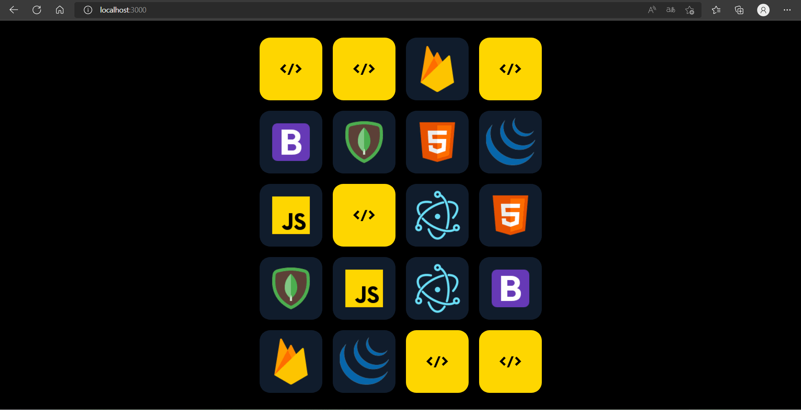

# Jogo da Memoria React   

## Funcionalidades:
- Checar se as carstas são iguais, se não forem desvira a carta.
- Manipular estados e passar os elementos por propriedades de pai para filho.

## Descrição:
- Para testar as skills que venho adquirindo ao longo do curso ProgramadorBR, em conjunto com o projeto desenvolvido pelo curso, Refiz o jogo da Memória onde antes feito toda a manipulação da carta com Js, agora com react ficou tudo mais fácil manipulando os estados com hooks e fazendo a verificação e manipulando o que vai aparecer na tela com o useEffect.
- Para passar as propriedades fui passando elas do pai para os filhos, mas futuramente ao aprender redux, modificarei para transmitir essas propriedades entre os componentes por redux.

## Apresentação do Projeto:
 

## Observação:
- Não consegui subir o projeto, mas basta apenas baixar a pasta e rodar no terminal.
- Para rodar apenas basta baixar e no terminal colocar: npm start
- Pronto, fazendo esses passos você pode testar a aplicação

## Gostou do meu projeto? :D Entre em contato comigo! 
- [Linkedin](https://www.linkedin.com/in/abner-santos-b195b8228/)  
- [Email: abner.kif1@gmail.com](mailto:abner.kif1@gmail.com)
- 
